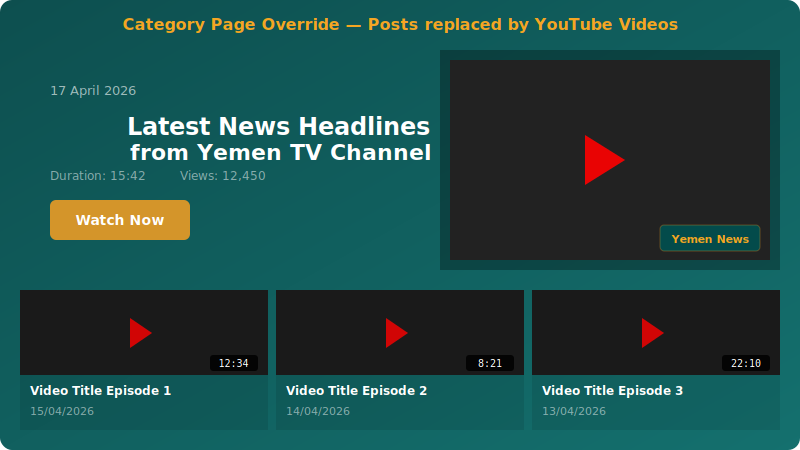
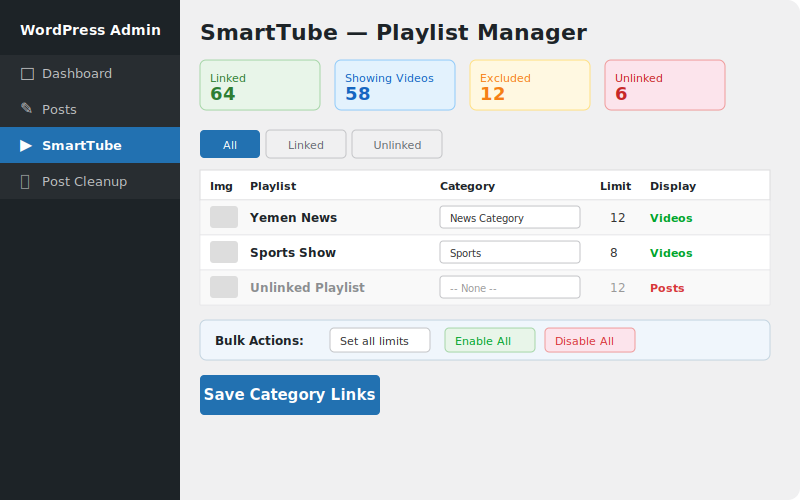

# SmartTube - YouTube Playlist Gallery for WordPress

<p align="center">
  
</p>

<p align="center">
  <strong>Transform your WordPress site into a YouTube video hub.</strong><br>
  Display channel playlists in grids, tabbed layouts, and category-based video pages — with lightbox on desktop and Picture-in-Picture on mobile.
</p>

<p align="center">
  
  
  
  
  
</p>

<p align="center">
  Built for <a href="https://yementv.tv">Yemen TV</a> and the Jannah theme, but works with any WordPress theme.
</p>

---

## Screenshots

### Category Page Override
YouTube videos replace WordPress posts on linked category pages — featured hero video + responsive grid.

<p align="center">
  
</p>

### Video Playback — Desktop Lightbox + Mobile PiP
Auto-detects device: lightbox popup on desktop, draggable floating PiP player on mobile.

<p align="center">
  
</p>

### Admin — Playlist Manager & Category Linker
Fetch playlists from your YouTube channel, link to WordPress categories, set limits, bulk enable/disable.

<p align="center">
  
</p>

---

## Features

### Video Display
- **Playlist Grid** — Display any YouTube playlist as a responsive 1-6 column grid
- **Tabbed Programs Layout** — Channel programs page with switchable tabs
- **Category Override** — Replace WordPress post loops with YouTube videos on category pages
- **Widget** — Sidebar widget for latest videos

### Playback Modes
- **Lightbox** — Click-to-play popup on desktop with dark overlay and ESC to close
- **PiP (Picture-in-Picture)** — Clean draggable floating video player on mobile
- **New Tab** — Open video on YouTube

### Admin Dashboard
- **Playlist Manager** — Fetch all playlists from your YouTube channel with one click
- **Category Linker** — Link playlists to WordPress categories with per-playlist video limits
- **Tabs Builder** — Visual shortcode generator for tabbed layouts
- **Bulk Actions** — Enable/disable all, set limits in bulk, create categories automatically
- **Exclude System** — Mark categories that should always show posts, never videos
- **Filter Tabs** — View all/linked/unlinked playlists with search

### Customization
- **CSS Variables** — `--stube-bg`, `--stube-header`, `--stube-accent`
- **Color Picker** — Set background, header, and accent colors from admin
- **RTL Support** — Full right-to-left layout for Arabic, Persian, etc.
- **Multi-language** — Works with Arabic, French, Persian, English sites

---

## Shortcodes

| Shortcode | Description |
|-----------|-------------|
| `[smarttube playlist="PLxxx" limit="12" columns="3"]` | Display a specific playlist grid |
| `[smarttube latest="10" title="Latest"]` | Show latest channel videos |
| `[smarttube_tabs auto="true" header="Programs"]` | Tabbed programs layout with all playlists |
| `[smarttube_tabs playlists="ID1:Name,ID2:Name"]` | Tabbed layout with specific playlists |
| `[smarttube_category]` | Auto-detect current category and show linked playlist |
| `[smarttube_programs auto="true" columns="3"]` | Programs grid with thumbnails |

---

## Installation

1. Upload the `smarttube` folder to `/wp-content/plugins/`
2. Activate the plugin in WordPress
3. Go to **SmartTube** in the admin sidebar
4. Enter your **YouTube API Key** and **Channel ID**
5. Click **Fetch Playlists**
6. Link playlists to categories and set video limits
7. Enable categories to show videos instead of posts

### Requirements

- WordPress 5.0+
- PHP 7.4+
- YouTube Data API v3 key ([Get one here](https://console.cloud.google.com/apis/library/youtube.googleapis.com))

---

## File Structure

```
smarttube/
  smarttube.php                    # Main plugin file (v1.4.0)
  includes/
    class-youtube-api.php          # YouTube Data API wrapper with transient caching
    class-shortcode.php            # All shortcodes: grid, tabs, programs, category
    class-category-override.php    # Hooks into Jannah theme to replace post loops
    class-admin.php                # Admin: settings, playlist manager, category linker
    class-widget.php               # Sidebar widget for latest videos
  assets/
    css/
      admin.css                    # Admin dashboard styles
      frontend.css                 # Frontend styles with CSS variables + PiP
    js/
      admin.js                     # Admin: save, fetch, bulk actions, tabs builder
      frontend.js                  # Lightbox, PiP player, tab switching
  screenshots/                     # README images
  languages/                       # Translation-ready
```

---

## How It Works

### Category Override Flow
1. Plugin hooks into `template_redirect` on category pages
2. Checks if the category has a linked + enabled playlist
3. Empties the main WP query (no posts shown)
4. Hooks into `TieLabs/after_archive_title` (Jannah theme)
5. Renders featured hero video + grid from YouTube API
6. Caches API responses as WordPress transients

### Playback Detection
```
User clicks video thumbnail
       |
  Is mobile device?
  /           \
YES            NO
 |              |
Open PiP      Open Lightbox
(draggable,   (fullscreen overlay,
 floating)     ESC to close)
```

---

## Theme Compatibility

| Theme | Support | Notes |
|-------|---------|-------|
| **Jannah** (TieLabs) | Full | Hooks into `TieLabs/after_archive_title` |
| **GeneratePress** | Grid + Tabs | Category override needs manual shortcode |
| **Astra** | Grid + Tabs | Category override needs manual shortcode |
| Any theme | Grid + Tabs | Use shortcodes in pages/widgets |

---

## Related Plugins

- **[PostCleaner](https://github.com/alahdal262/postcleaner)** — Bulk delete posts and images by category with progress bar

---

## Changelog

### 1.4.0
- Separated Post Cleanup into standalone plugin [PostCleaner](https://github.com/alahdal262/postcleaner)
- SmartTube is now focused purely on YouTube video display

### 1.3.3
- Clean PiP player — video only, no background or header bar
- All video clicks use lightbox (desktop) or PiP (mobile) automatically

### 1.3.0
- Category override system for Jannah theme
- Excluded categories feature
- Bulk enable/disable and limit actions

### 1.2.0
- Tabbed programs layout
- Visual tabs builder with shortcode generator
- Category linking with per-playlist limits

### 1.1.0
- Playlist fetcher from YouTube channel
- Standard grid shortcode
- Lightbox and inline play modes

### 1.0.0
- Initial release

---

## License

GPL-2.0-or-later

## Author

**Yemen TV Media** — [yementv.tv](https://yementv.tv)
